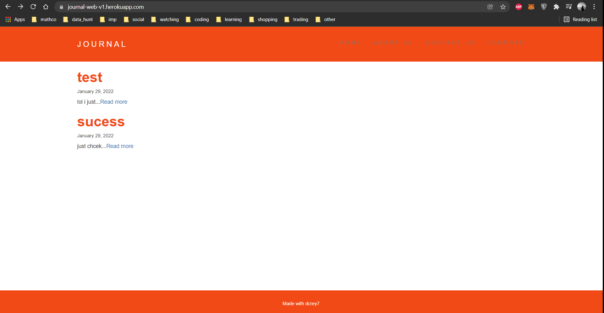
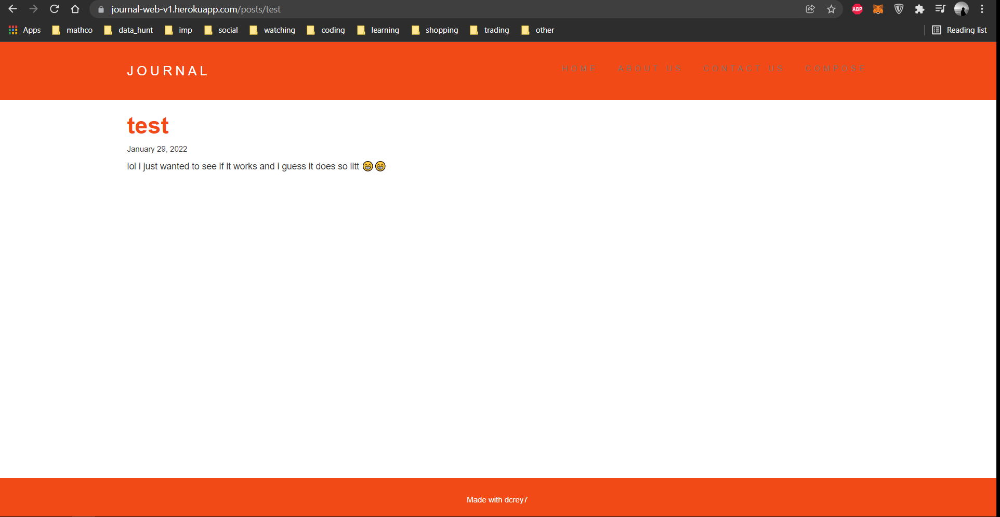
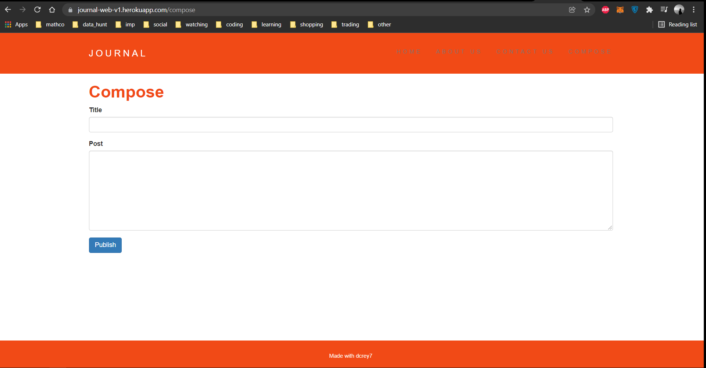
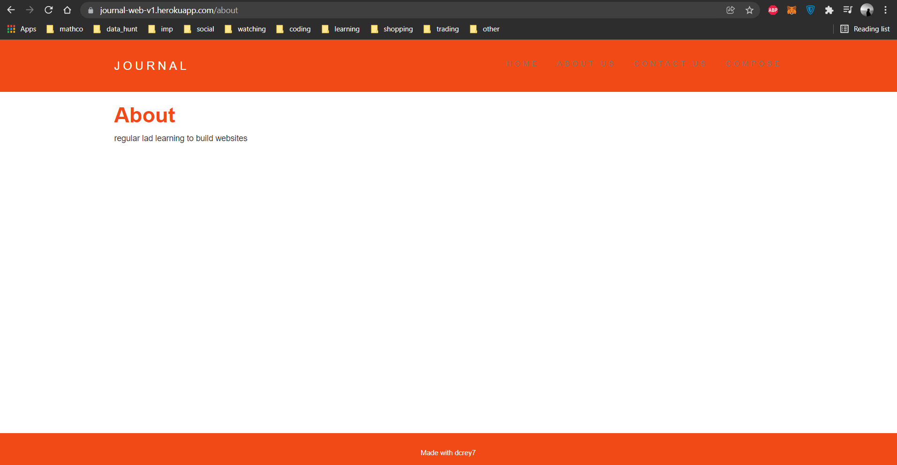
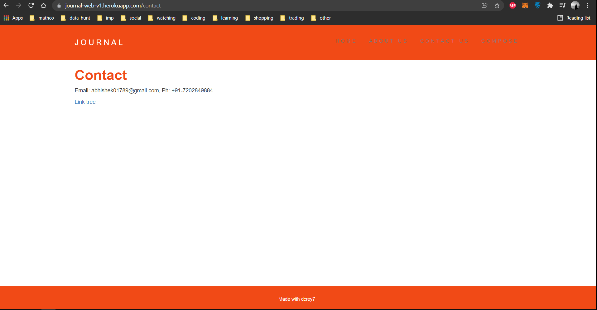

# journal_web

Website using javascript, html , css, lodash , express , body parser, dynamic-read-me pages and editable journal

- https://journal-web-v1.herokuapp.com/

- <h1>Overview of journal</h1>

- <h1>Checking each post</h1>

- <h1>Compose an entry so that it appears on home</h1>

- <h1>about page</h1>

- <h1>contact us page</h1>

